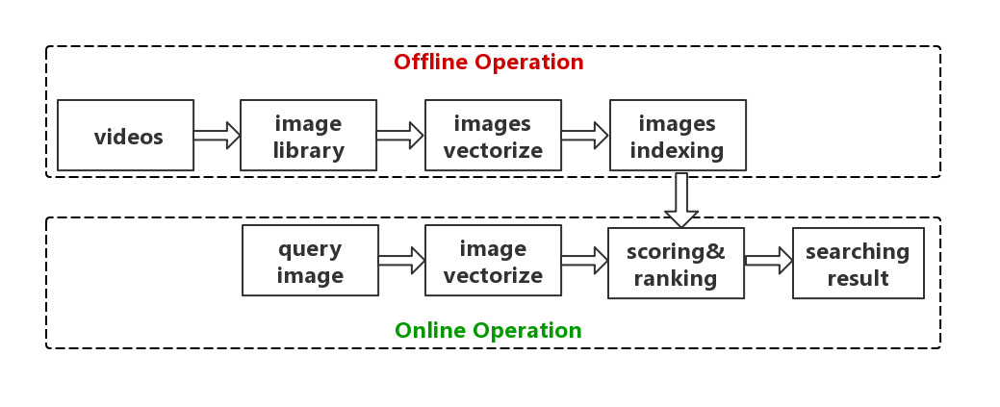

## 1. Introduction
This is an image retrieval project.  
We aim to search for the most similar image in some videos, compared with the queried image.   
The image library is composed of images from some adds videos.    
The query images are some screenshots from internet.  

  
## 2.Tools  
python 3,   
opencv 3,   
fiass    

## 3. Modules   
 
 