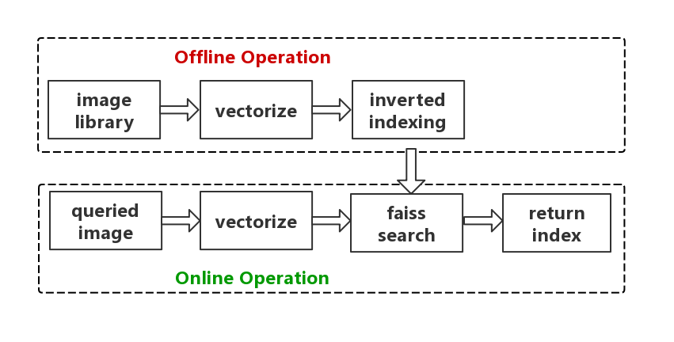

#### 1. Introduction
This is an image retrieval project.  
for a queried image, we want to search the most similar image in the image library.
+ Offline Operation:  
Extracting feature vector of each image in the image library.  
Constructing inverted index of these vectors.
+ Online Operation:  
Extracting feature vector of queried image.  
Searching the most similar image in image library, return its index.  

  
#### 2.Tools  
python 3,   
opencv 4,   
faiss 1.6    
tensorflow 1.12

 
 